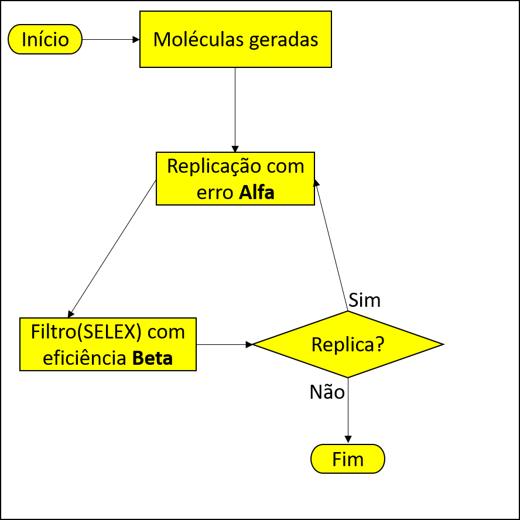
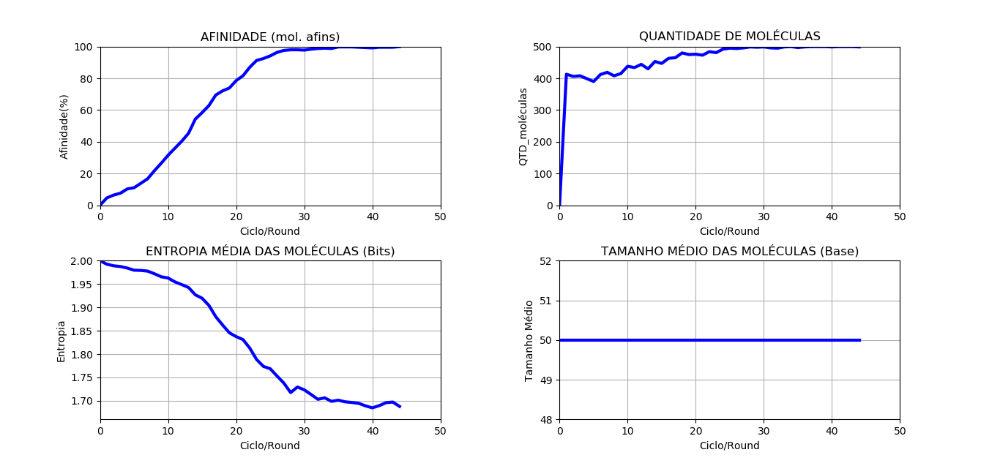

<h1 align="center">Evolução molecular computacional</h1>
 

Evolução molecular por meio de simulações computacionais

 

  

 

  

 
 

<h1 align="center">CASE 1:</h1>
 

<h2 align="center">DIAGRAM</h2>
 

  

 
  <h2 align="center">STEPS:</h2>
 

 1. As moléculas são geradas com base no tamanho e quantidade solicitada.
 2. As moléculas são replicadas, podendo conter uma probabilidade de mutação entre sua estrutura molecular.
 3. As moléculas são deletadas aleatóreamente de forma que não prejudique na analise.
 4. As moléculas são filtradas de forma que moléculas não adaptadas tenham uma probabilidade de morrer.
 5. As moléculas voltam para o passo de replicação.

 

<h2 align="center">PARAMETERS</h2>
<strong>QUANTITY OF MOLECULES:</strong> 
<code>quantity_molecules = 500</code>
  
<strong>MOLECULES SIZE:</strong> 
<code>size_molecule = 50</code>
  
<strong>MUTATION RATE(%):</strong> 
<code>alpha = 10</code>
  
<strong>FILTER EFFICIENCY(%):</strong> 
<code>beta = 20</code>
  
<strong>TARGET:</strong> 
<code>target = 5</code>
  
<strong>CYCLES LIMIT:</strong> 
<code>cycles_limit = 3</code>
  
<strong>MOLECULES LIMIT:</strong> 
<code>molecules_limit = 500</code>
 

 
  <h2 align="center">CLASS AND FUNCTIONS:</h2>
 
  <h3 align="center">PRIMARY CLASS AND FUNCTIONS:</h3>
 

<strong>Class Selex:</strong> 
Onde estão as funções referentes a amplificação, mutação e seleção de moléculas. 
<strong>Parameters:</strong> <code>Selex(quantity_molecules, size_molecule, target)</code>
  
<strong>Function PolymeraseChainReaction:</strong> 
Onde acontece a replicação das moléculas com probabilidade de mutação. 
<strong>Parameters:</strong> <code>Selex().PolymeraseChainReaction(alpha)</code>
  
<strong>Function ConstantPopulation:</strong> 
Limita a quantidade de moléculas. 
<strong>Parameters:</strong> <code>Selex().ConstantPopulation(molecules_limit)</code>
  
<strong>Function Filter:</strong> 
Elimina moléculas não afim com base na eficiencia do filtro. 
<strong>Parameters:</strong> <code>Selex().Filter(beta)</code>

 
  <h3 align="center">SECUNDARY CLASS AND FUNCTIONS:</h3>
 

<strong>Class Tools:</strong> 
Onde estão armazenadas funções para analise ou métodos abstraidos.
  
<strong>Function RandomBase:</strong> 
Retorna sequencia de bases aleatórias de acordo com a quantidade pedida. 
<strong>Parameters:</strong> <code>Tools().RandomBase(amount)</code>
  
<strong>Function Affinity:</strong> 
Retorna o precentual de afinidade do clico com base nas moleculas. 
<strong>Parameters:</strong> <code>Tools().Affinity(target, molecules)</code>
  
<strong>Function AverageSize:</strong> 
Retorna o tamanho médio de todas as moléculas. 
<strong>Parameters:</strong> <code>Tools().AverageSize(molecules)</code>
 

 
  <h2 align="center">RESULTS:</h2>
 

<h2 align="center">VARIAÇÃO DE MUTAÇÃO:</h2>
<table>
  <tr>
    <td>
      

        <strong>ALPHA: 0% | BETA: 20%</strong>
        
      

    </td>
    <td>
      

        <strong>ALPHA: 0% | BETA: 20%</strong>
        
      

    </td>
  </tr>
  <tr>
    <td>
      

        <strong>ALPHA: 0% | BETA: 20%</strong>
        
      

    </td>
  </tr>
  <tr>
    <td>
      

        <strong>ALPHA: 0% | BETA: 20%</strong>
        
      

    </td>
  </tr>
</table>

Teste 1.0 - (Alfa: 0% / Beta: 20%)

Teste 1.1 - (Alfa: 5% / Beta: 20%)

Teste 1.2 - (Alfa: 15% / Beta: 20%)

Teste 1.3 - (Alfa: 20% / Beta: 20%)

Teste 1.4 - (Alfa: 5% / Beta: 0% a 100%)

<h2 align="center">VARIAÇÃO DE EFICIÊNCIA DE FILTRO:</h2>

Teste 1.5 - (Alfa: 5% / Beta: 0%)

Teste 1.6 - (Alfa: 5% / Beta: 10%)

Teste 1.7 - (Alfa: 5% / Beta: 50%)

Teste 1.8 - (Alfa: 5% / Beta: 80%)

Teste 1.9 - (Alfa: 5% / Beta: 90%)

Teste 1.10 - (Alfa: 0% a 100% / Beta: 20%)

<h2 align="center">CALCULO X SIMULAÇÃO</h2>

Teste 1.11 - (Calculado X Simulado[Alfa: 5% / Beta: 60%])

## License

This project is licensed under the MIT License - see the [LICENSE](https://opensource.org/licenses/MIT) page for details.

