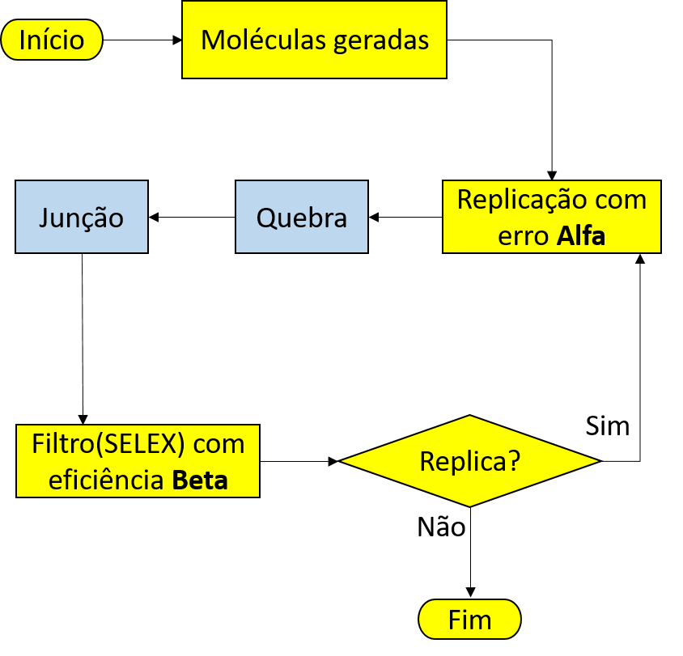
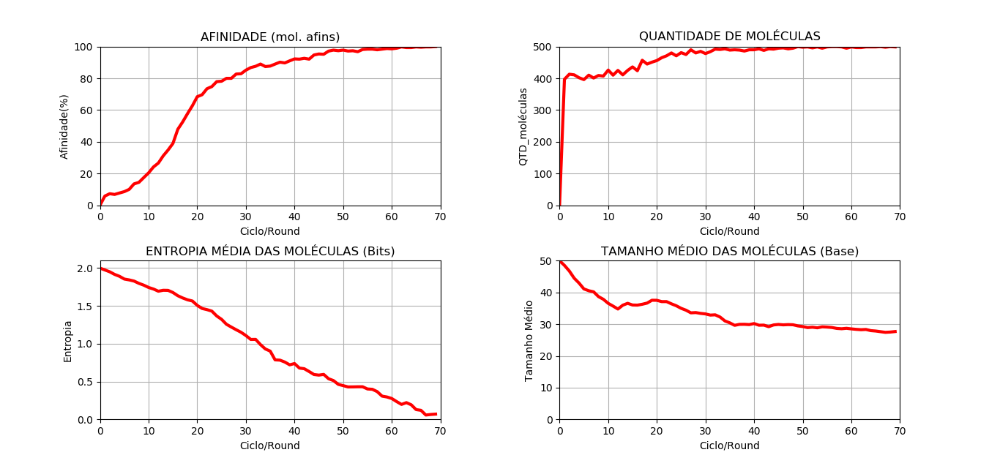
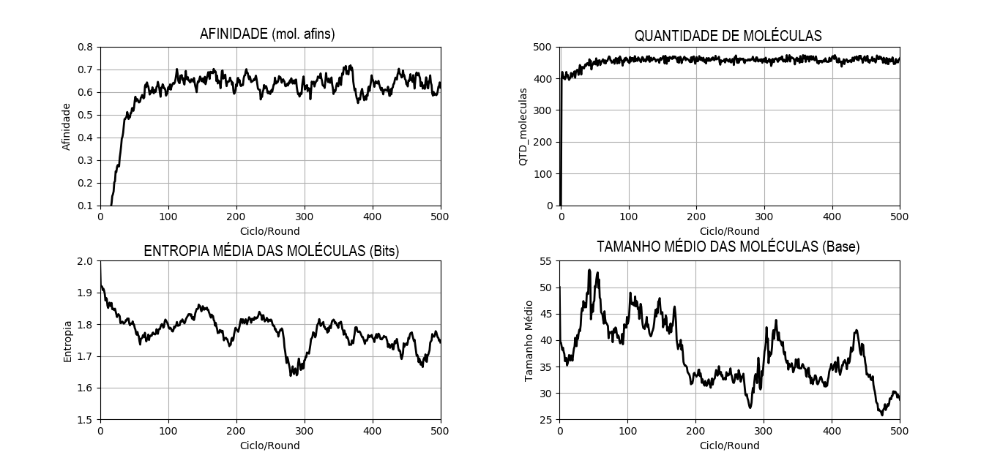
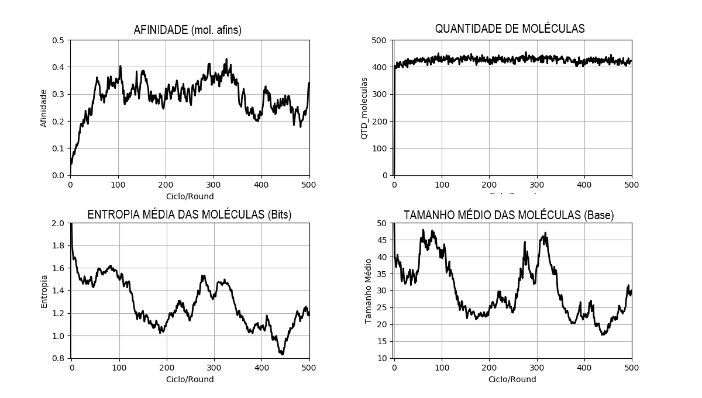
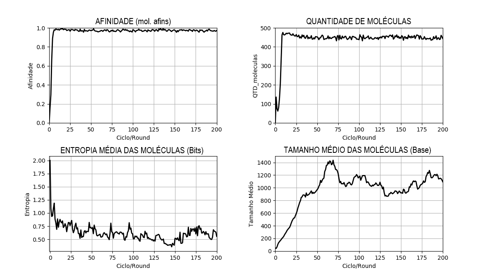
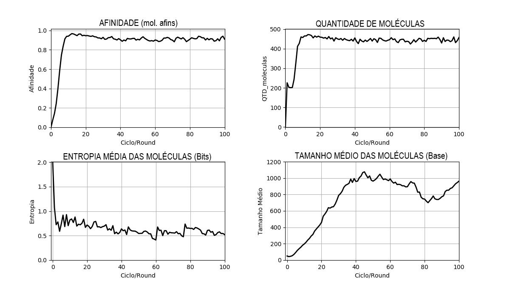

<h1 align="center">Evolução molecular computacional</h1>
 

Evolução molecular por meio de simulações computacionais

 

  

 

  

 
 

<h1 align="center">CASE 2</h1>
 

NEWS: Neste cenário teve o incremento de duas novas variaves, sendo elas, chance de quebra e junção de uma molécula.
A intenção é ver como as moléculas irão se comportar a partir desta situação.

 
<h2 align="center">DIAGRAM</h2>
 

  

 
  <h2 align="center">STEPS</h2>
 

 1. As moléculas são geradas com base no tamanho e quantidade solicitada.
 2. As moléculas são replicadas, podendo conter uma probabilidade de mutação entre sua estrutura molecular.
 3. As moléculas passam por um processo de quebra caso tenham uma seuqência de três bases denominada de 'stop códon'.
 4. As moléculas passam por um processo de junção caso uma tenham uma determinada sequência.
 5. As moléculas são deletadas aleatóreamente de forma que não prejudique na analise.
 6. As moléculas são filtradas de forma que moléculas não adaptadas tenham uma probabilidade de morrer.
 7. As moléculas voltam para o passo de replicação.
 8. As moléculas são analisadas base a base medindo o nível de organização entre elas apartir da entropia.

 

<h2 align="center">PARAMETERS</h2>
<strong>QUANTITY OF MOLECULES:</strong> 
<code>quantity_molecules = 500</code>
  
<strong>MOLECULES SIZE:</strong> 
<code>size_molecule = 50</code>
  
<strong>MUTATION RATE(%):</strong> 
<code>alpha = 10</code>
  
<strong>FILTER EFFICIENCY(%):</strong> 
<code>beta = 20</code>
  
<strong>TARGET:</strong> 
<code>target = 5</code>
  
<strong>CYCLES LIMIT:</strong> 
<code>cycles_limit = 3</code>
  
<strong>MOLECULES LIMIT:</strong> 
<code>molecules_limit = 500</code>
  
<strong>BREAK:</strong> 
<code>condon_break = 'TTT'</code>
<code>prob_break = 10</code>
  
<strong>JOIN:</strong> 
<code>prob_join = 5</code>
 

 
  <h2 align="center">CLASS AND FUNCTIONS</h2>
 
  <h3 align="center">PRIMARY CLASS AND FUNCTIONS</h3>
 

<strong>Class Selex:</strong> 
Onde estão as funções referentes a amplificação, mutação e seleção de moléculas. 
<strong>Parameters:</strong> <code>Selex(quantity_molecules, size_molecule, target)</code>
  
<strong>Function PolymeraseChainReaction:</strong> 
Onde acontece a replicação das moléculas com probabilidade de mutação. 
<strong>Parameters:</strong> <code>Selex().PolymeraseChainReaction(alpha)</code>
  
<strong>Function ConstantPopulation:</strong> 
Limita a quantidade de moléculas. 
<strong>Parameters:</strong> <code>Selex().ConstantPopulation(molecules_limit)</code>
  
<strong>Function Filter:</strong> 
Elimina moléculas não afim com base na eficiencia do filtro. 
<strong>Parameters:</strong> <code>Selex().Filter(beta)</code>
  
<strong>Function Break:</strong> 
Onde acontece a quebra de moléculas com base no Stop Códon 'TTT'. 
<strong>Parameters:</strong> <code>Selex().Break(codon_break, prob_break)</code>
  
<strong>Function Join:</strong> 
Onde acontece a junção das moléculas que juntas tenha um par especifico de sequência e com uma probabilidade de ocorrer essa junção. 
<strong>Parameters:</strong> <code>Selex().Join(prob_join)</code>

 
  <h3 align="center">SECUNDARY CLASS AND FUNCTIONS</h3>
 

<strong>Class Tools:</strong> 
Onde estão armazenadas funções para analise ou métodos abstraidos.
  
<strong>Function RandomBase:</strong> 
Retorna sequencia de bases aleatórias de acordo com a quantidade pedida. 
<strong>Parameters:</strong> <code>Tools().RandomBase(amount)</code>
  
<strong>Function Affinity:</strong> 
Retorna o precentual de afinidade do clico com base nas moleculas. 
<strong>Parameters:</strong> <code>Tools().Affinity(target, molecules)</code>
  
<strong>Function AverageSize:</strong> 
Retorna o tamanho médio de todas as moléculas. 
<strong>Parameters:</strong> <code>Tools().AverageSize(molecules)</code>

 
  <h3 align="center">CLASS AND FUNCTIONS FOR ANALYSIS</h3>
 

<strong>Class ShannonEntropy:</strong> 
Onde são analisadas as moléculas base á base para medir a entropia.
  
<strong>Function Result:</strong> 
Retorna a entropia com base nas moléculas. 
<strong>Parameters:</strong> <code>ShannonEntropy().Result(molecules)</code>
   

 
  <h2 align="center">RESULTS</h2>
 

<h2 align="center">CHANGE RATE VARIATION</h2>
<table>
  <tr>
    <td>
      

        <strong>ALPHA: 00% | BETA: 20%</strong>
        
      

    </td>
  </tr>
  <tr>
    <td>
      

        <strong>ALPHA: 05% | BETA: 20%</strong>
        
      

    </td>
  </tr>
  <tr>
    <td>
      

        <strong>ALPHA: 10% | BETA: 20%</strong>
        
      

    </td>
  </tr>
</table>

<h2 align="center">VARIATION OF THE FILTER EFFICIENCY RATE</h2>

<table>
  <tr>
    <td>
      

        <strong>ALPHA: 05% | BETA: 20%</strong>
        
      

    </td>
  </tr>
  <tr>
    <td>
      

        <strong>ALPHA: 05% | BETA: 40%</strong>
        
      

    </td>
  </tr>
  <tr>
    <td>
      

        <strong>ALPHA: 05% | BETA: 90%</strong>
        
      

    </td>
  </tr>
</table>

## License

This project is licensed under the MIT License - see the [LICENSE](https://opensource.org/licenses/MIT) page for details.

